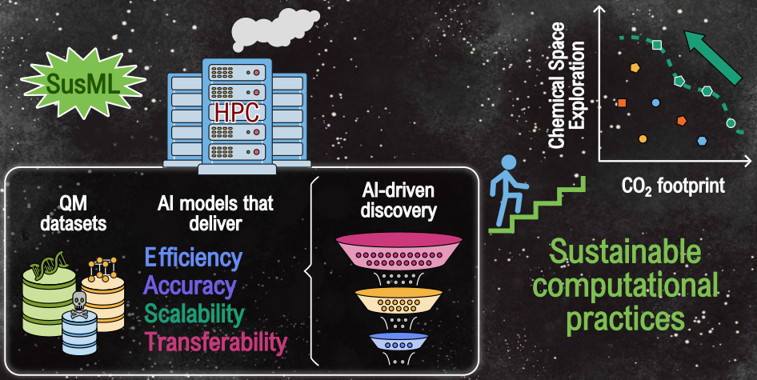

[](https://doi.org/10.48550/arXiv.2604.00069)

# SusML Benchmark: What Is the Carbon Footprint of Your AI Model and QM Dataset?

## About
Artificial intelligence is transforming molecular and materials science, but its growing computational and data demands raise critical sustainability challenges. In this Perspective, we examined resource considerations across the AI-driven discovery pipeline, building on discussions from the **SusML workshop: Towards sustainable exploration of chemical spaces with machine learning** held in Dresden, Germany. 

<p align="center">

</p>

## Carbon footprint in the AI-driven discovery pipeline

As part of this perspective, we compiled a table reporting the estimated carbon footprint of representative examples spanning quantum-mechanical datasets generation, machine-learning force fields, large language models, and quantitative structure-property/activity relationship models. Carbon footprints were estimated using the [](https://calculator.green-algorithms.org/) framework, a web-based initiative that allow researchers to estimate the environmental impact of computational workloads based on parameters such as runtime, number of cores/GPUs used, memory, location, etc.

We invite the community to contribute their own data by adding new entries to this `README` file and submitting a pull request. By collectively reporting computational requirements alongside model performance, we aim to establish a living, community-driven resource for comparing the computational and environmental costs of machine learning approaches and to encourage more transparent and sustainable computational practices in the field.

### Quantum-Mechanical Dataset Generation

| Name | Description | Computing time [hrs] | Carbon footprint [CO₂e] | Ref. | 
|---|---|---:|---:|---:| 
| QM7-X | $\approx$ 4.2 M small molecules | 3.27 M CPU | 9.14 tons | [Hoja et al. (2021)](https://www.nature.com/articles/s41597-021-00812-2)| 
| ANI-1x/1ccx | $\approx$ 5.5 M small molecules | 14 M CPU | 32.23 tons | [Smith et al. (2020)](https://www.nature.com/articles/s41597-020-0473-z)|
| GEMS | $\approx$ 3 M molecular building blocks and biomolecular fragments | 576 M CPU | 12,800 tons |[Unke et al. (2024)](https://www.science.org/doi/10.1126/sciadv.adn4397)|
| QUED-LD50 | $\approx$ 3.6 M drug-like molecules | 314 k CPU | 1.34 tons | [Hinostroza et al. (2026)](https://pubs.rsc.org/dd/article/5/2/803/312878/Assessing-the-performance-of-quantum-mechanical)|
| OMol25 | $\approx$ 140 M diverse molecular systems | 6.6 B CPU | 20,600 tons | [Levine et al. (2025)](https://arxiv.org/abs/2505.08762)|
| Materials Project | $\approx$ 785 k materials and molecules | 965 M CPU | 18,900 tons | [Horton et al. (2025)](https://www.nature.com/articles/s41563-025-02272-0)|
| OMat24 | $\approx$ 118 M materials | 400 M CPU | 1,250 tons | [Barros-Luque et al. (2026)](https://www.nature.com/articles/s43588-026-00996-w)|
| MAD-1.5 | $\approx$ 216 k materials and molecules | 40 M CPU | 30 tons | [Malosso et al. (2026)](https://arxiv.org/abs/2603.02089)|
| **+ Add entry** |  |  |  |  |

### General-Purpose Machine Learning Interatomic Portentials

#### (Bio)molecular simulations
Equivariant models trained on molecular QM data for (bio) molecular simulations

| Name | Computing time [hrs] | Carbon footprint [CO₂e] | Ref. | 
|---|---:|---:|---:|
| MACE-OFF23(L) | 336 GPU | 28.34 kg | [Kovacs et al. (2025)](https://pubs.acs.org/jacsat/article/147/21/17598/3736678/MACE-OFF-Short-Range-Transferable-Machine-Learning)|
| MACE-POLAR1(M) | 15,360 GPU | 2.75 tons | [Batatia et al. (2026)](https://arxiv.org/abs/2602.19411)|
| MACE-POLAR1(L) | 23,040 GPU | 4.13 tons | [Batatia et al. (2026)](https://arxiv.org/abs/2602.19411)|
| SO3LR | 86 GPU | 12.81 kg | [Kabylda et al. (2025)](https://pubs.acs.org/jacsat/article/147/37/33723/3739037/Molecular-Simulations-with-a-Pretrained-Neural)|
| **+ Add entry** |  |  |  |

#### Materials
Equivariant models trained on materials QM data for materials simulations

| Name | Computing time [hrs] | Carbon footprint [CO₂e] | Ref. |
|---|---:|---:|---:|
| MACE-MP-0 | 2,600 GPU | 236.62 kg | [Batatia et al. (2025)](https://pubs.aip.org/aip/jcp/article/163/18/184110/3372267/A-foundation-model-for-atomistic-materials)|
| GRACE-1L-OMAT | 400 GPU | 73.67 kg | [Lysogorskiy et al. (2026)](https://www.nature.com/articles/s41524-026-01979-1)|
| GRACE-2L-OMAT-L | 700 GPU | 128.92 kg | [Lysogorskiy et al. (2026)](https://www.nature.com/articles/s41524-026-01979-1)|
| PET-MAD-XS | 143 GPU | 5 kg | [Malosso et al. (2026)](https://arxiv.org/abs/2603.02089)|
| PET-MAD-S | 190 GPU | 7.5 kg | [Malosso et al. (2026)](https://arxiv.org/abs/2603.02089)|
| **+ Add entry** |  |  |  |

### Large Language Models

| Name | Computing time [hrs] | Carbon footprint [CO₂e] | Ref. |
|---|---:|---:|---:|
| BERT |  - | 652 kg | [Devlin et al. (2019)](https://arxiv.org/abs/1810.04805)|
| BERT-QA | - | 46.4 g | [Sipila et al. (2025)](https://www.nature.com/articles/s43246-025-00979-w)|
| MechBERT Cased | 600 GPU | 188.77 kg | [Kumar et al. (2025)](https://pubs.acs.org/jcisd8/article/65/4/1873/3686381/MechBERT-Language-Models-for-Extracting-Chemical)|
| BERT-MechQA | < 4 GPU | 1.26 kg | [Zhang et al. (2026)](https://pubs.acs.org/jcisd8/article/66/7/3840/5138343/Automatic-Generation-of-a-Mechanical-Properties)|
| XLNet-MechQA | < 4 GPU | 1.26 kg | [Zhang et al. (2026)](https://pubs.acs.org/jcisd8/article/66/7/3840/5138343/Automatic-Generation-of-a-Mechanical-Properties)|
| Llama-MechQA | 16 GPU | 5.03 kg | [Zhang et al. (2026)](https://pubs.acs.org/jcisd8/article/66/7/3840/5138343/Automatic-Generation-of-a-Mechanical-Properties)|
| Llama 3.1-405B | 30.84 M GPU | 8,930 tons | [Llama team (2024)](https://arxiv.org/abs/2407.21783)|
| Llama 3.1-70B | 7M GPU | 2,040 tons | [Llama team (2024)](https://arxiv.org/abs/2407.21783)|
| Olmo 3-32B | 1.12 M GPU | 502,871 tons | [Olmo team (2026)](https://arxiv.org/abs/2512.13961)|
| Olmo 3-7B | 246.5 k GPU | 104,701 tons | [Olmo team (2026)](https://arxiv.org/abs/2512.13961)|
| **+ Add entry** |  |  |

### Quantitative Structure-Property Relationships

| Name | Computing time [hrs] | Carbon footprint [CO₂e] | Ref. |
|---|---:|---:|---:|
| SISSO(10F) | - | 8.18 g | - |
| SISSO(50F) | - | 492.42 g | - | 
| ENINet | 6.5 GPU | 1.27 kg |  [Mao et al. (2025)](https://pubs.acs.org/jctcce/article/21/16/7954/3693394/Molecule-Graph-Networks-with-Many-Body-Equivariant)|
| SchNet | 21 GPU | 4.79 kg |  [Ye et al. (2020)](https://pubs.acs.org/jpcafh/article/124/34/6945/1375150/Symmetrical-Graph-Neural-Network-for-Quantum)|
| QUED-DQM | 14.9 CPU | 89 g |  [Hinostroza et al. (2026)](https://pubs.rsc.org/dd/article/5/2/803/312878/Assessing-the-performance-of-quantum-mechanical)|
| QUED-SOAP | 7.16 k CPU | 33.86 kg | [Hinostroza et al. (2026)](https://pubs.rsc.org/dd/article/5/2/803/312878/Assessing-the-performance-of-quantum-mechanical)|
| **+ Add entry** |  |  |

## Contributions
We welcome contributions! If you have a new QM dataset or AI model to add or updates to existing ones, please submit a pull request.

## Citations
If you use the dataset please cite
```
@article{susml,
      title={Perspective: Towards sustainable exploration of chemical spaces with machine learning}, 
      author={ Medrano Sandonas, Leonardo and David Balcells and Anton Bochkarev and Jacqueline M. Cole and Volker L. Deringer and Werner Dobrautz and Adrian Ehrenhofer and Thorben Frank and Pascal Friederich and Rico Friedrich and Janine George and Luca Ghiringhelli and Alejandra Hinostroza Caldas and Veronika Juraskova and Hannes Kneiding and Yury Lysogorskiy and Johannes T. Margraf and Hanna Türk and Anatole von Lilienfeld and Milica Todorović and Alexandre Tkatchenko and Mariana Rossi and Gianaurelio Cuniberti},
      year={2026},
      journal={arXiv preprint arXiv:2604.00069},
    note={https://arxiv.org/abs/2604.00069}, 
}
```

